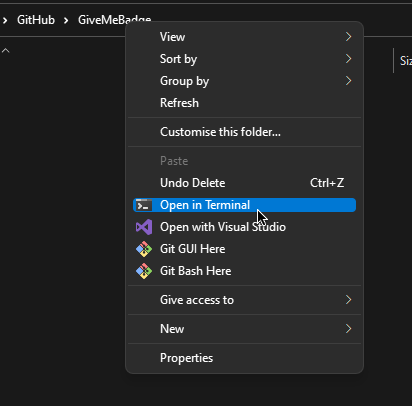
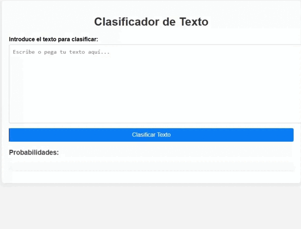

# Clasificador de Texto

Este proyecto es una aplicación web de clasificador de texto construida con Flask y utiliza un modelo de aprendizaje automático para clasificar textos en diferentes categorías. La aplicación permite a los usuarios ingresar texto, y el clasificador devuelve la categoría correspondiente junto con las probabilidades de cada clase.

## Tabla de Contenidos
- [Tabla de Contenidos](#tabla-de-contenidos)
- [Requisitos](#requisitos-🧾)
- [Uso](#uso-✨)

# Requisitos 🧾
- Python 3.8 o superior (https://www.python.org/downloads)
  - Version Recomendada [3.10.2](https://www.python.org/downloads/release/python-3102/)

## Uso ✨


### ✏️ <ins>Step 1:</ins>
Descargar e Instalar [Python](https://www.python.org/downloads) si no lo has hecho todavia.

<div>
    
    <br>
    <br>
</div>


### ✏️ <ins>Step 2:</ins>
Abre CMD/Terminal dentro de esta carpeta.
> En Windows, abre un `símbolo del sistema` como administrador. Escribe `cd` seguido de un espacio y arrastra la carpeta deseada dentro de la ventana. Presiona enter.

<div style="text-align: center;">
    
    <br>
    <br>
</div>


### ✏️ <ins>Step 3:</ins>
Install `requirements.txt` with the command below
```
pip install -r requirements.txt
```
> Si tienes algun error, probablemente necesites ejecutar el símbolo del sistema como administrador.

<div>
    
    <br>
    <br>
</div>


### ✏️ <ins>Step 3:</ins>
Abre el script utilizando el comando. (Puede ser diferente; por ejemplo, en Linux y MacOS se puede usar python3)
```
python app.py
```

<div style="text-align: center;">
    
    <br>
    <br>
</div>


### ✏️ <ins>Step 4:</ins>
Navega a [index.html](http://127.0.0.1:5000). Con esto ya puedes empezar a usar la IA, tan solo tienes que escribir un texto y la IA te dirá que tipo de texto es.

<div style="text-align: center;">
    
    <br>
    <br>
</div>